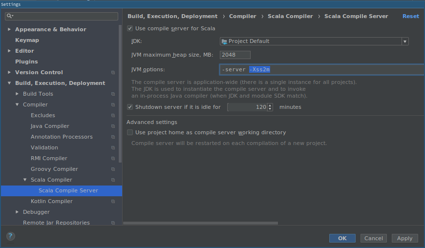
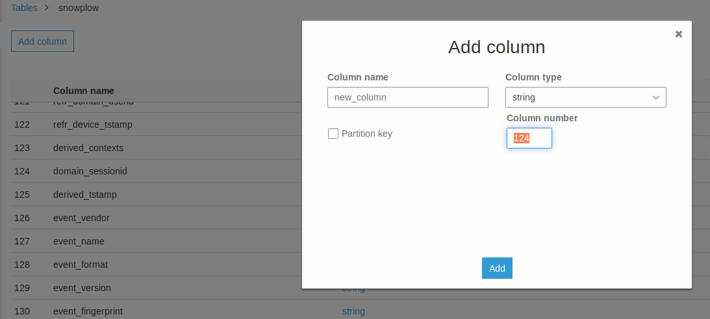

# Snowplow TSV to Parquet
Convert Snowplow TSV files to Parquet format while also extracting some information from the custom contexts to their own columns for faster lookup.

# Environment variables
```bash
IN_BUCKET=jpmedier-datalake-dev
OUT_BUCKET=behavior-datalake-dev
PARTITION_DATABASE=snowplow-dev
ATHENA_OUTPUT_LOCATION=aws-athena-query-results-092102721606-eu-west-1/snowplow-partitions
```

# Compiling in IntelliJ IDEA
The default settings for the Scala Compile Server in IntelliJ IDEA will result in compilation errors due to the compiler crashing when type checking the code. To avoid this, change the `Xss` JVM option for the Scala Compile Server to `2m`. Go to `Settings` (`CTRL+ALT+S`) and change the `JVM options` setting for the Scala Compile Server:



# Adding new columns to Athena/Glue
After adding a new column to the ContextExploder and Schemas, go to AWS Glue, select your database and table, and choose Edit Schema.
As we're using parquet files (read by name, default), you can freely add columns anywhere in the table. The new column will push the old ones, so what used to be 124 will now be 125 in the example below.

The new column will be queryable if the data exists, otherwise it won't return anything. The rest of the table will work as expected either way.

You can choose to disable the tsv-to-parquet task on Airflow while updating the schema, to ensure no tasks are running while the change is going through.


# Backfilling using IntelliJ IDEA
If backfilling of snowplow-tsv-to-parquet is needed, following should be done:

1. Set environment variables
```bash
AWS_ASSUME_ROLE_ARN=arnForProdDeveloperRole
AWS_ROLE_SESSION_NAME=yourOwnSessionName
```
2. Setup LocalMain with the needed dates to process/backfill. 
3. Run LocalMain (with required environment variables from the top.) 