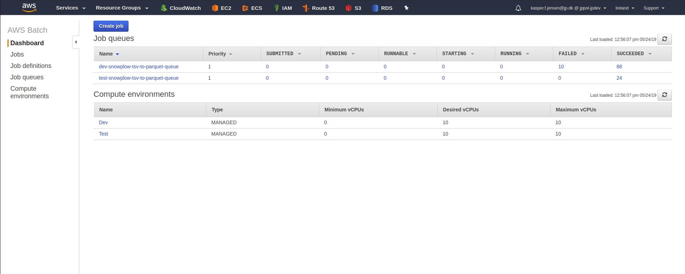

# Snowplow TSV to Parquet
Convert Snowplow TSV files to Parquet format while also extracting some information from the custom contexts to their own columns for faster lookup.

# Environment variables
```bash
IN_BUCKET=jpmedier-datalake-dev
OUT_BUCKET=behavior-datalake-dev
PARTITION_DATABASE=snowplow-dev
ATHENA_OUTPUT_LOCATION=aws-athena-query-results-092102721606-eu-west-1/snowplow-partitions
```

# Compiling in IntelliJ IDEA
The default settings for the Scala Compile Server in IntelliJ IDEA will result in compilation errors due to the compiler crashing when type checking the code. To avoid this, change the `Xss` JVM option for the Scala Compile Server to `2m`. Go to `Settings` (`CTRL+ALT+S`) and change the `JVM options` setting for the Scala Compile Server:


# Adding new columns to Athena/Glue
After adding a new column to the ContextExploder and Schemas, go to AWS Glue, select your database and table, and choose Edit Schema.
As we're using read by name, you can freely add columns anywhere in the table. The new column will push the old ones, so what used to be 124 will now be 125 in the example below, however, as we refer to the columns by name, you can still query for the columns that have been pushed forward.

The new column will be queryable if the data exists, otherwise it won't return anything. The rest of the table will work as expected either way.

You can choose to disable the tsv-to-parquet task on Airflow while updating the schema, to ensure no tasks are running while the change is going through.


## What about Terraform?
We add columns through the AWS Console. The alternative is to run the Glue Crawler to find the new columns automatically, however, this takes a long time. The Glue Crawler is defined in Terraform so if we ever need to recreate it, we can. If we have to recreate the columns, just run the Glue Crawler.

## Case sensitivity in AWS Glue
AWS Glue only supports lowercase when defining the schema for, for example, arrays or struct type. Even though the documentation says `ARRAY<STRING>`, you should write `array<string>`. 

# Backfilling using AWS Batch 
If backfilling of snowplow-tsv-to-parquet is needed. This method has no limitations. You can backfill years with no need to manually do anything. 
This method adds a number of jobs to a queue in AWS Batch. AWS Batch maintains a computed cluster where the jobs in the queue is run. 
The speed of the backfilling job is based on the maximum allowed number of VCPUs allow in the computed cluster and the number of jobs.

To added a job to queue you need to CD to /snowplow_tsv_to_parquet/src/main/scripts/

You need python and boto3 to run this scripts. Start your virtual env and install requirements.

The script used to add the jobs to AWS Batch: trigger_backfill_on_aws_batch.py

The script takes three parameters:

```
python3.6 trigger_backfill_on_aws_batch.py emvironment startdate enddate

ex.
python3.6 trigger_backfill_on_aws_batch.py 'dev '2018-11-20' '2018-12-01'

ex. prod
{prod-script} terraform-prod python3.6 trigger_backfill_on_aws_batch.py 'prod' '2018-11-20' '2018-12-01'
```

The script prints weather or not adding the jobs to AWS Batch is a success.

Now you can monitor the backfilling from the AWS Batch dashboard. This keeps and overview of the state of each job.
If some of the jobs fail you can retry them from here. If multiple fail, you can remove them from the queue and run the script again.



# Test resources modified on save
IntelliJ has a weird setting where it will strip whitespace in files when you save. This is a problem when working with the test resources which may end in several tabs.

If you touch the test resources with this setting enabled, the tests may fail. `CTRL+A` and search for `Strip trailing spaces on Save:` and set it to `None`.
